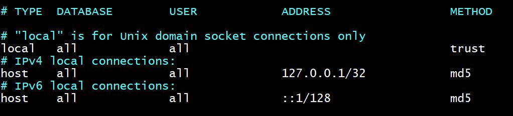

## Install and configure Sonar on Centos 7


## Sonarqube requirements
1. Server with minimum 2GB/1 vcpu capacity
2. PostgreSQL version 9.3 or greater.
3. OpenJDK 11 or JRE 11
4. All sonarquber process should run as a non-root ## sonarqube ## user.

## Update: MySQL for Sonarqube is depricated


**Prep the Server With Required Softwares**
```bash
yum install wget unzip -y

yum install java-11-openjdk-devel -y

sysctl -w vm.max_map_count=524288

sysctl -w fs.file-max=131072

ulimit -n 131072

ulimit -u 8192

```
## Open the file /etc/security/limits.conf
```
vi /etc/security/limits.conf
#add the below lines
elasticsearch   soft    nofile          65536
elasticsearch   hard    nofile          65536
elasticsearch   memlock unlimited
sonarqube - nofile 65535
```

**Setup PostgreSQL 10 Database For SonarQube**
```bash
#Install PostgreSQL 10 repo
yum install https://download.postgresql.org/pub/repos/yum/reporpms/EL-7-x86_64/pgdg-redhat-repo-latest.noarch.rpm -y

#Install PostgreSQL 10 repo
yum install postgresql10-server postgresql10-contrib -y

#Initialize the database
/usr/pgsql-10/bin/postgresql-10-setup initdb

#Open /var/lib/pgsql/10/data/pg_hba.conf file to change the authentication to md5.

vi /var/lib/pgsql/10/data/pg_hba.conf

#Find the following lines at the bottom of the file and change peer to trust and idnet to md5
```


**Start and enable PostgreSQL**
```bash
systemctl start postgresql-10
systemctl enable postgresql-10
```
>**Note** You can verify the installation using the following version select query.
```bash
sudo -u postgres /usr/pgsql-10/bin/psql -c "SELECT version();"
```

## Setup Sonarqube User and Database
```bash
#Change the default password of the Postgres user. All Postgres commands have to be executed from this user.

sudo passwd postgres #set the password as postgres

#Login as postgres user with the new password.

su - postgres

#create user sonarqube

createuser sonarqube

#Login to the PostgreSQL CLI.
psql

#Create a sonarqubedb database

create database sonarqubedb;

#Create the sonar DB user with a strongly encrypted password. Replace your-strong-password with a strong password.

create user sonar with encrypted password 'your-strong-password'; 

#Next, grant all privileges to sonrqube user on sonarqubedb.

grant all privileges on database sonarqubedb to sonar

#Exit the psql prompt using the following command.

\q
exit
```

## Setup Sonarqube Web Server
```bash
#Download the latest sonarqube installation file to /opt folder. You can get the latest download link from here. http://www.sonarqube.org/downloads/

cd /opt

wget https://binaries.sonarsource.com/Distribution/sonarqube/sonarqube-9.0.1.46107.zip

#Unzip sonarqube source files and rename the folder.

unzip sonarqube-9.0.1.46107.zip

mv sonarqube-9.0.1.46107 sonarqube

# Open /opt/sonarqube/conf/sonar.properties file.

vi /opt/sonarqube/conf/sonar.properties

```
>**Note** Uncomment and edit the parameters as shown below. Change the password accordingly. 
You will find jdbc parameter under PostgreSQL section

```text
sonar.jdbc.username=sonar
sonar.jdbc.password=your-strong-password
sonar.jdbc.url=jdbc:postgresql://localhost/sonarqube
sonar.web.context=/sonar
sonar.web.javaOpts=-Xmx2048m -Xms1024m -XX:+HeapDumpOnOutOfMemoryError
```

>**Note** By default, sonar will run on 9000. If you want on port 80 or any other port, change the following parameters for accessing the web console on that specific port.

```
sonar.web.host=0.0.0.0
sonar.web.port=80
```
>**Note** If you want to access sonarqube some path like http://url:/sonar, change the following parameter.

```
sonar.web.context=/sonar
```

## Add Sonarqube User and Privileges

```bash
#Create a user named sonarqube

useradd sonarqube

#make it the owner of the /opt/sonarqube directory.

chown -R sonarqube:sonarqube /opt/sonarqube
```

## Start Sonarqube Service
To start sonar service, you need to use the script in sonarqube bin directory.

```bash
#Login as sonarqube user

sudo su - sonarqube

#Navigate to the start script directory.

cd /opt/sonarqube/bin/linux-x86-64

#Open the SonarQube startup script and specify the sonarqube user details.

vi /opt/sonarqube/bin/linux-x86-64/sonar.sh +49

#add below line

RUN_AS_USER=sonarqube

#Start the sonarqube service

./sonar.sh start

#Check the application status. If it is in running state, you can access the sonarqube dashboard using the DNS name or Ip address of your server:9000/sonar

./sonar.sh status
```

## Setting up Sonarqube as a service

```bash
#Create a file /etc/systemd/system/sonarqube.service

vi  /etc/systemd/system/sonarqube.service

#Copy the following content on to the file.
```
```text
[Unit]
Description=SonarQube service
After=syslog.target network.target

[Service]
Type=simple
User=sonarqube
Group=sonarqube
PermissionsStartOnly=true
ExecStart=/bin/nohup java -Xms32m -Xmx32m -Djava.net.preferIPv4Stack=true -jar /opt/sonarqube/lib/sonar-application-9.0.1.46107.jar
StandardOutput=syslog
LimitNOFILE=65536
LimitNPROC=8192
TimeoutStartSec=5
Restart=always

[Install]
WantedBy=multi-user.target
```
## Start and enable sonarqube
```bash
systemctl daemon-reload
systemctl start sonarqube
systemctl enable sonarqube
systemctl status  sonarqube
```


